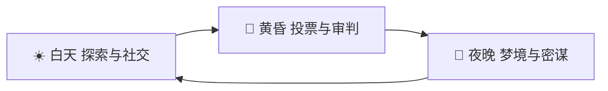

[English](README_en.md) | **中文**

# 《荒岛：人性的试炼》 (Project: The Island)

一个实时多人互动的荒岛生存+社交博弈游戏。10 个性格迥异的 AI 被投放到荒岛，观众通过弹幕和礼物影响 AI 的命运——帮助他们结盟、陷害对手、获取资源，活到最后。

## 项目架构

```
the-island/
├── backend/                  # Python FastAPI 后端服务
│   └── app/
│       ├── main.py            # FastAPI 应用入口
│       ├── server.py          # WebSocket 服务器
│       ├── engine.py          # 游戏引擎 Facade（730 行）
│       ├── simulation.py      # 生存/社交/活动/建造模拟逻辑
│       ├── command_handler.py # 玩家命令处理（9 个命令）
│       ├── config.py          # 游戏常量配置
│       ├── models.py          # SQLAlchemy 数据模型
│       ├── repositories.py    # 数据访问层
│       ├── schemas.py         # Pydantic 消息协议
│       ├── llm.py             # LLM 集成（对话生成）
│       ├── memory_service.py  # Agent 记忆管理
│       ├── twitch_service.py  # Twitch 聊天机器人
│       ├── director_service.py # AI 导演服务（叙事生成）
│       ├── vote_manager.py    # 投票管理器
│       └── database.py        # 数据库配置
├── frontend/                  # Web 调试客户端
├── unity-client/              # Unity 6 游戏客户端
│   └── Assets/Scripts/        # C# 游戏脚本
├── .github/workflows/         # CI/CD
└── backend/tests/             # 195 个测试
```

## 游戏设定

10 个性格迥异的 AI 被投放到荒岛。目标：**活到最后**。

**性格谱系**：
- **老实人**（Jack）：诚实可靠，容易相信他人
- **心机女**（Luna）：善于操控，见风使舵
- **暴躁哥**（Rex）：脾气火爆，一言不合就翻脸
- **圣母**（Maya）：乐于助人，宁愿自己挨饿也要分享
- **独狼**（Shadow）：不信任任何人，独自行动
- **骗子**（Fox）：谎话连篇，偷窃成性
- **领袖**（Alpha）：自信果断，天然吸引追随者
- **懦夫**（Mouse）：胆小怕事，遇事就躲
- **赌徒**（Dice）：热爱冒险，高风险高回报
- **智者**（Sage）：冷静理性，擅长分析和制作

---

## 游戏循环：一天三幕



### ☀️ 白天：探索与社交（Simulation）

AI 们搜集资源、彼此聊天、结盟或树敌。

| 观众行为 | 触发方式 | 效果 |
|----------|----------|------|
| **风声（免费）** | 发送弹幕 | AI 会听到"风声"——可能改变他们对其他人的看法 |
| **空投物资（付费）** | 刷指定礼物 | 空投落到岛上，AI 争夺。独占或分享影响社交地位 |
| **喂食/治疗** | `feed` / `heal` | 消耗金币恢复 AI 状态 |

### 🌅 黄昏：投票与审判（Voting）

AI 围坐火堆旁，讨论今天谁贡献最少，投票流放一人。

| 机制 | 说明 |
|------|------|
| 讨论环节 | AI 根据当天事件和记忆，发表对彼此的看法 |
| 投票流放 | 每人一票，得票最高者被流放（死亡） |
| **赎罪券（核心付费点）** | 被流放的 AI 会哭诉求饶，此时刷特定礼物可赐予"免死金牌" |

获得免死金牌的 AI 会**极其感激救命恩人**，成为恩人的死忠粉，后续游戏中无条件支持恩人的指令。

### 🌙 夜晚：梦境与密谋（Private Chat）

AI 进入睡眠。观众可付费进入 AI 梦境进行私聊。

| 模式 | 说明 | 付费 |
|------|------|------|
| **公开风声** | 对所有人可见的弹幕 | 免费 |
| **入梦私聊（高级玩法）** | 进入特定 AI 的梦境，告诉他明天陷害谁、投靠谁 | 付费 |

---

## 游戏系统

### 生存机制
- **HP / 能量 / 心情** 三大属性
- **疾病系统**：恶劣天气导致生病，可用药品治愈
- **制作系统**：采集草药 → 制作药品
- **建造系统**：建造掩体/瞭望塔/农场/工坊
- **贸易系统**：Agent 间交换物品
- **休闲模式**：自动复活、降低难度
- **资源稀缺**：树木果实有限，每日再生

### 社交系统
- **关系网络**：友好/中立/敌对，动态变化
- **社交角色**：leader / follower / loner / neutral
- **派系行为**：领导者影响追随者行动
- **记忆系统**：Agent 记住重要的互动和事件

### AI 导演系统
- **叙事事件**：导演根据世界状态生成剧情
- **观众投票**：`!1` / `!2` 决定剧情走向
- **四种模式**：simulation → narrative → voting → resolution

### 天气与时间
- **天气**：Sunny / Cloudy / Rainy / Stormy / Hot / Foggy
- **昼夜**：dawn → day → dusk → night

---

## 玩家命令

| 命令 | 格式 | 消耗 | 效果 |
|------|------|------|------|
| feed | `feed <角色名>` | 10g | +20 能量, +5 HP |
| heal | `heal <角色名>` | 15g | +30 HP, 治愈疾病 |
| talk | `talk <角色名> [话题]` | 0g | 与角色对话 |
| encourage | `encourage <角色名>` | 5g | +15 心情 |
| revive | `revive <角色名>` | 10g | 复活死亡角色 |
| build | `build <建筑类型>` | 20-35g | 建造掩体/农場/工坊等 |
| trade | `trade <角色> <物品> <数量>` | 0g | 角色间物品交换 |
| check | `check` | 0g | 查看所有状态 |
| reset | `reset` | 0g | 重置游戏 |
| !1 / !A | `!1` 或 `!A` | 0g | 投票选择第一选项 |
| !2 / !B | `!2` 或 `!B` | 0g | 投票选择第二选项 |

## 技术栈

### 后端
- **Python 3.11+**
- **FastAPI** - 异步 Web 框架
- **WebSocket** - 实时双向通信
- **SQLAlchemy** - ORM 数据持久化
- **SQLite** - 轻量级数据库
- **LiteLLM** - 多 LLM 提供商支持
- **TwitchIO** - Twitch 聊天集成

### Unity 客户端
- **Unity 6 LTS** (6000.3.2f1)
- **TextMeshPro** - 高质量文本渲染
- **NativeWebSocket** - WebSocket 通信
- **2.5D 风格** - 精灵 + Billboard UI

## 快速开始

### 1. 启动后端服务

```bash
cd backend
pip install -r requirements.txt
uvicorn app.main:app --reload --host 0.0.0.0 --port 8000
```

### 2. 启动 Unity 客户端

1. 使用 Unity 6 打开 `unity-client` 文件夹
2. 打开 `Assets/Scenes/main.unity`
3. 点击 Play 运行游戏

### 3. Web 调试客户端 (可选)

在浏览器打开 `frontend/debug_client.html`

## Unity 客户端结构

### 核心脚本
| 脚本 | 功能 |
|------|------|
| `NetworkManager.cs` | WebSocket 连接管理、消息收发 |
| `GameManager.cs` | 游戏状态管理、角色生成、行动系统 |
| `UIManager.cs` | 主 UI 界面 (顶部状态栏、底部命令输入) |
| `EventLog.cs` | 事件日志面板 (显示游戏事件) |
| `AgentVisual.cs` | 角色视觉组件 (精灵、血条、对话框、状态图标) |
| `EnvironmentManager.cs` | 环境场景 (沙滩、海洋、天空) |
| `WeatherEffects.cs` | 天气粒子效果 (雨、雾、热浪) |
| `Models.cs` | 数据模型 (Agent、WorldState、事件数据) |
| `NarrativeUI.cs` | AI 导演叙事界面 (剧情卡片、投票进度条、倒计时) |

### 视觉特性
- 程序化生成的 2.5D 角色精灵
- Billboard UI (始终面向摄像机)
- 动态天气粒子系统
- 渐变天空盒 (随时间变化)
- 海浪动画效果

## 中文字体支持

项目使用 **思源黑体 (Source Han Sans SC)** 支持中文显示。

### 手动配置步骤
1. 选择 `Assets/Fonts/SourceHanSansSC-Regular.otf`
2. 右键 → Create → TextMeshPro → Font Asset → SDF
3. 打开 Edit → Project Settings → TextMesh Pro
4. 在 Fallback Font Assets 中添加生成的字体资产

## 通信协议

### WebSocket 端点
```
ws://localhost:8000/ws/{username}
```

### 事件类型
```python
# 核心事件
TICK            # 游戏心跳
AGENTS_UPDATE   # 角色状态更新
AGENT_SPEAK     # 角色发言
AGENT_DIED      # 角色死亡

# 时间系统
PHASE_CHANGE    # 时段变化 (黎明/白天/黄昏/夜晚)
DAY_CHANGE      # 新的一天
WEATHER_CHANGE  # 天气变化

# 玩家互动
FEED            # 喂食反馈
HEAL            # 治疗反馈
TALK            # 对话反馈
ENCOURAGE       # 鼓励反馈
REVIVE          # 复活反馈
GIFT_EFFECT     # Bits 打赏特效

# 社交系统
SOCIAL_INTERACTION  # 角色间社交
AUTO_REVIVE         # 自动复活 (休闲模式)

# 自主行动系统 (Phase 13+)
AGENT_ACTION    # 角色执行行动 (采集/休息/社交等)
CRAFT           # 制作物品 (药品等)
USE_ITEM        # 使用物品
RANDOM_EVENT    # 随机事件 (风暴/宝藏/野兽等)

# AI 导演与叙事投票 (Phase 9)
MODE_CHANGE         # 游戏模式切换 (simulation/narrative/voting/resolution)
NARRATIVE_PLOT      # 导演生成的剧情事件
VOTE_STARTED        # 投票开始
VOTE_UPDATE         # 实时投票进度更新
VOTE_ENDED          # 投票结束
VOTE_RESULT         # 投票结果
RESOLUTION_APPLIED  # 剧情决议执行

# 建造与贸易 (Phase 23)
BUILDING_STARTED    # 建造开始
BUILDING_COMPLETED  # 建造完成
GIVE_ITEM           # 物品交易/赠送
GROUP_ACTIVITY      # 篝火故事等集体活动
```

## Twitch 直播集成

游戏支持连接到 Twitch 直播聊天室，观众可以通过发送弹幕来控制游戏。

### 获取 Twitch Token

**方法一：Twitch Token Generator (推荐用于测试)**
1. 访问 https://twitchtokengenerator.com/
2. 选择 "Bot Chat Token"
3. 使用你的 Twitch 账号授权
4. 复制 "Access Token" (以 `oauth:` 开头)

**方法二：Twitch Developer Console (生产环境)**
1. 访问 https://dev.twitch.tv/console/apps
2. 创建新应用，类型选择 "Chat Bot"
3. 设置 OAuth 重定向 URL: `http://localhost:3000`
4. 使用 OAuth 授权码流程获取 Token
5. 需要的权限范围: `chat:read`, `chat:edit`, `bits:read`

### Bits 打赏转换

观众在直播间使用 Bits 打赏时，系统会自动将 Bits 转换为游戏内金币：
- **转换比率**: 1 Bit = 1 Gold
- Unity 客户端会收到 `gift_effect` 事件用于显示特效

## 环境变量

在 `backend/.env` 文件中配置：

```env
# LLM 配置 (选择一种)
ANTHROPIC_API_KEY=your_api_key_here
# 或
OPENAI_API_KEY=your_api_key_here
LLM_MODEL=gpt-3.5-turbo

# Twitch 配置 (可选)
TWITCH_TOKEN=oauth:your_access_token_here
TWITCH_CHANNEL_NAME=your_channel_name
TWITCH_COMMAND_PREFIX=!
```

### 必需变量
| 变量 | 说明 |
|------|------|
| `LLM_MODEL` | LLM 模型名称 |
| `ANTHROPIC_API_KEY` 或 `OPENAI_API_KEY` | LLM API 密钥 |

### Twitch 变量 (可选)
| 变量 | 说明 |
|------|------|
| `TWITCH_TOKEN` | OAuth Token (必须以 `oauth:` 开头) |
| `TWITCH_CHANNEL_NAME` | 要加入的频道名称 |
| `TWITCH_COMMAND_PREFIX` | 命令前缀 (默认 `!`) |

## 开发说明

### 添加新命令
1. 在 `backend/app/config.py` 添加命令正则和常量
2. 在 `backend/app/command_handler.py` 添加命令处理逻辑
3. 在 `backend/app/schemas.py` 添加新事件类型（如需要）
4. 在 `unity-client/Assets/Scripts/Models.cs` 添加数据模型
5. 在 `unity-client/Assets/Scripts/NetworkManager.cs` 添加事件处理

### 运行测试
```bash
cd backend
python -m pytest tests/ -v --cov=app
```

### 调试
- Unity 控制台查看日志
- Web 调试客户端查看原始消息
- 后端日志查看服务器状态

### 后续规划
- **Phase 22**：持久化升级（PostgreSQL + Redis）
- **Phase 24**：多人增强（排行榜、团队任务）
- **Phase 25**：运营工具（管理后台、数据分析面板）

## 许可证

MIT License
