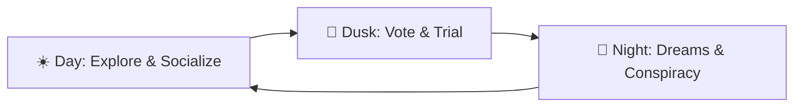

[中文](README.md) | **English**

# "The Island: Trial of Human Nature" (Project: The Island)

A real-time multiplayer survival + social strategy game. Ten AI characters with distinct personalities are stranded on an island. Viewers influence their fate through chat and gifts — helping them form alliances, frame rivals, hoard resources, and survive to the end.

## Project Architecture

```
the-island/
├── backend/                  # Python FastAPI backend
│   └── app/
│       ├── main.py            # FastAPI application entry
│       ├── server.py          # WebSocket server
│       ├── engine.py          # Game engine facade (730 lines)
│       ├── simulation.py      # Survival/social/activity/building logic
│       ├── command_handler.py # Player command processing (9 commands)
│       ├── config.py          # Game constants
│       ├── models.py          # SQLAlchemy data models
│       ├── repositories.py    # Data access layer
│       ├── schemas.py         # Pydantic message protocol
│       ├── llm.py             # LLM integration (dialogue generation)
│       ├── memory_service.py  # Agent memory management
│       ├── twitch_service.py  # Twitch chat bot
│       ├── director_service.py # AI Director (narrative generation)
│       ├── vote_manager.py    # Voting system
│       └── database.py        # Database configuration
├── frontend/                  # Web debug client
├── unity-client/              # Unity 6 game client
│   └── Assets/Scripts/        # C# game scripts
├── .github/workflows/         # CI/CD
└── backend/tests/             # 195 tests
```

## Game Setting

Ten AI characters with distinct personalities are stranded on a deserted island. Goal: **be the last one standing**.

**Personality Spectrum**:
- **The Honest One** (Jack): Reliable but gullible
- **The Manipulator** (Luna): Schemes behind every smile
- **The Hothead** (Rex): Explosive temper, holds grudges
- **The Saint** (Maya): Gives away her last meal
- **The Loner** (Shadow): Trusts no one, goes solo
- **The Trickster** (Fox): Lies, steals, and charms his way through
- **The Alpha** (Alpha): Natural leader, attracts followers
- **The Coward** (Mouse): Runs from every conflict
- **The Gambler** (Dice): High risk, high reward
- **The Sage** (Sage): Cold logic, master craftsman

---

## Game Loop: Three Acts Per Day



### ☀️ Day: Exploration & Social (Simulation)

AIs gather resources, chat with each other, form alliances or make enemies.

| Viewer Action | Trigger | Effect |
|---------------|---------|--------|
| **Whispers (free)** | Send chat message | AIs "hear rumors" — may shift their opinion of others |
| **Supply Drop (paid)** | Send specific gift | Airdrop lands on island, AIs fight over it. Hoarding or sharing affects social status |
| **Feed / Heal** | `feed` / `heal` | Spend gold to restore AI stats |

### 🌅 Dusk: Vote & Trial (Voting)

AIs gather around the campfire, debate who contributed the least, and vote to exile one person.

| Mechanic | Description |
|----------|-------------|
| Debate | AIs express opinions based on the day's events and their memories |
| Exile Vote | One vote each. Highest vote count gets exiled (killed) |
| **Pardon (core monetization)** | The condemned AI begs for mercy. A viewer can send a specific gift to grant "immunity" |

A pardoned AI becomes **eternally loyal** to their savior, unconditionally supporting that viewer's commands for the rest of the game.

### 🌙 Night: Dreams & Conspiracy (Private Chat)

AIs sleep. Viewers can pay to enter an AI's dream for private conversation.

| Mode | Description | Cost |
|------|-------------|------|
| **Public Whispers** | Chat visible to all viewers | Free |
| **Dreamwalking (premium)** | Enter a specific AI's dream, tell them who to frame or ally with tomorrow | Paid |

---

## Game Systems

### Survival
- **HP / Energy / Mood** core stats
- **Sickness**: harsh weather causes illness, curable with medicine
- **Crafting**: gather herbs → craft medicine
- **Building**: construct shelters, watchtowers, farms, workshops
- **Trading**: agents exchange items
- **Casual mode**: auto-revive, reduced difficulty
- **Resource scarcity**: finite fruit, daily regeneration

### Social
- **Relationship network**: friendly / neutral / hostile, dynamically shifting
- **Social roles**: leader / follower / loner / neutral
- **Faction behavior**: leaders influence followers' actions
- **Memory system**: agents remember important interactions

### AI Director
- **Narrative events**: director generates plot points based on world state
- **Audience voting**: `!1` / `!2` decides story direction
- **Four modes**: simulation → narrative → voting → resolution

### Weather & Time
- **Weather**: Sunny / Cloudy / Rainy / Stormy / Hot / Foggy
- **Day cycle**: dawn → day → dusk → night

---

## Player Commands

| Command | Format | Cost | Effect |
|---------|--------|------|--------|
| feed | `feed <name>` | 10g | +20 Energy, +5 HP |
| heal | `heal <name>` | 15g | +30 HP, cure sickness |
| talk | `talk <name> [topic]` | 0g | Chat with an agent |
| encourage | `encourage <name>` | 5g | +15 Mood |
| revive | `revive <name>` | 10g | Revive dead agent |
| build | `build <type>` | 20-35g | Build shelter/farm/workshop etc. |
| trade | `trade <name> <item> <qty>` | 0g | Trade items between agents |
| check | `check` | 0g | View all status |
| reset | `reset` | 0g | Reset game |
| !1 / !A | `!1` or `!A` | 0g | Vote for first option |
| !2 / !B | `!2` or `!B` | 0g | Vote for second option |

## Tech Stack

### Backend
- **Python 3.11+**
- **FastAPI** — async web framework
- **WebSocket** — real-time bidirectional communication
- **SQLAlchemy** — ORM data persistence
- **SQLite** — lightweight database
- **LiteLLM** — multi-provider LLM support
- **TwitchIO** — Twitch chat integration

### Unity Client
- **Unity 6 LTS** (6000.3.2f1)
- **TextMeshPro** — high-quality text rendering
- **NativeWebSocket** — WebSocket communication
- **2.5D style** — sprites + Billboard UI

## Quick Start

### 1. Start Backend

```bash
cd backend
pip install -r requirements.txt
uvicorn app.main:app --reload --host 0.0.0.0 --port 8000
```

### 2. Start Unity Client

1. Open `unity-client` folder with Unity 6
2. Open `Assets/Scenes/main.unity`
3. Press Play to run

### 3. Web Debug Client (optional)

Open `frontend/debug_client.html` in a browser

## Unity Client Structure

### Core Scripts
| Script | Role |
|--------|------|
| `NetworkManager.cs` | WebSocket connection, message routing |
| `GameManager.cs` | Game state, agent spawning, event orchestration |
| `UIManager.cs` | Main UI (status bar, command input) |
| `EventLog.cs` | Event log panel with color-coded entries |
| `AgentVisual.cs` | Agent visuals (sprites, health bars, speech bubbles) |
| `EnvironmentManager.cs` | Environment (beach, ocean, sky) |
| `WeatherEffects.cs` | Weather particle effects (rain, fog, heat) |
| `Models.cs` | Data models (agent, world state, event data) |
| `NarrativeUI.cs` | AI Director narrative UI (plot cards, voting bars) |

### Visual Features
- Procedurally generated 2.5D agent sprites
- Billboard UI (always faces camera)
- Dynamic weather particle systems
- Gradient skybox (time-of-day transitions)
- Ocean wave animations

## Chinese Font Support

Uses **Source Han Sans SC** for Chinese character rendering.

### Manual Setup
1. Select `Assets/Fonts/SourceHanSansSC-Regular.otf`
2. Right-click → Create → TextMeshPro → Font Asset → SDF
3. Open Edit → Project Settings → TextMesh Pro
4. Add generated font asset to Fallback Font Assets

## Communication Protocol

### WebSocket Endpoint
```
ws://localhost:8000/ws/{username}
```

### Event Types
```python
# Core Events
TICK            # Game heartbeat
AGENTS_UPDATE   # Agent status broadcast
AGENT_SPEAK     # Agent speech (LLM response)
AGENT_DIED      # Agent death

# Time System
PHASE_CHANGE    # Dawn/day/dusk/night transition
DAY_CHANGE      # New day started
WEATHER_CHANGE  # Weather changed

# Player Interactions
FEED            # Feed feedback
HEAL            # Heal feedback
TALK            # Conversation feedback
ENCOURAGE       # Encourage feedback
REVIVE          # Revive feedback
GIFT_EFFECT     # Bits/sub gift effect

# Social System
SOCIAL_INTERACTION  # Agent-to-agent interaction
AUTO_REVIVE         # Auto-revive (casual mode)

# Autonomous Action
AGENT_ACTION    # Agent performs action (gather, rest, socialize)
CRAFT           # Item crafted
USE_ITEM        # Item used
RANDOM_EVENT    # Random event (storm, treasure, beast)

# AI Director & Narrative Voting
MODE_CHANGE         # Game mode transition
NARRATIVE_PLOT      # Director-generated plot
VOTE_STARTED        # Voting session started
VOTE_UPDATE         # Real-time vote update
VOTE_ENDED          # Voting closed
VOTE_RESULT         # Final voting result
RESOLUTION_APPLIED  # Plot resolution executed

# Building & Trading (Phase 23)
BUILDING_STARTED    # Construction started
BUILDING_COMPLETED  # Construction completed
GIVE_ITEM           # Item trade/gift
GROUP_ACTIVITY      # Campfire stories, group events
```

## Twitch Integration

The game connects to Twitch chat. Viewers control the game by sending chat messages.

### Getting a Twitch Token

**Method 1: Twitch Token Generator (recommended for testing)**
1. Visit https://twitchtokengenerator.com/
2. Select "Bot Chat Token"
3. Authorize with your Twitch account
4. Copy the "Access Token" (starts with `oauth:`)

**Method 2: Twitch Developer Console (production)**
1. Visit https://dev.twitch.tv/console/apps
2. Create a new app, type "Chat Bot"
3. Set OAuth redirect URL: `http://localhost:3000`
4. Use OAuth authorization code flow
5. Required scopes: `chat:read`, `chat:edit`, `bits:read`

### Bits to Gold Conversion

Bits sent in stream are automatically converted to in-game gold:
- **Rate**: 1 Bit = 1 Gold
- Unity client receives `gift_effect` events for visual effects

## Environment Variables

Configure in `backend/.env`:

```env
# LLM Configuration (choose one)
ANTHROPIC_API_KEY=your_api_key_here
# or
OPENAI_API_KEY=your_api_key_here
LLM_MODEL=gpt-3.5-turbo

# Twitch Configuration (optional)
TWITCH_TOKEN=oauth:your_access_token_here
TWITCH_CHANNEL_NAME=your_channel_name
TWITCH_COMMAND_PREFIX=!
```

### Required
| Variable | Description |
|----------|-------------|
| `LLM_MODEL` | LLM model name |
| `ANTHROPIC_API_KEY` or `OPENAI_API_KEY` | LLM API key |

### Twitch (optional)
| Variable | Description |
|----------|-------------|
| `TWITCH_TOKEN` | OAuth Token (must start with `oauth:`) |
| `TWITCH_CHANNEL_NAME` | Channel to join |
| `TWITCH_COMMAND_PREFIX` | Command prefix (default `!`) |

## Development

### Adding a New Command
1. Add command regex and constants in `backend/app/config.py`
2. Add command handler logic in `backend/app/command_handler.py`
3. Add new event type in `backend/app/schemas.py` (if needed)
4. Add data model in `unity-client/Assets/Scripts/Models.cs`
5. Add event handler in `unity-client/Assets/Scripts/NetworkManager.cs`

### Running Tests
```bash
cd backend
python -m pytest tests/ -v --cov=app
```

### Debugging
- Unity console for client logs
- Web debug client for raw messages
- Backend logs for server state

### Roadmap
- **Phase 22**: Persistence upgrade (PostgreSQL + Redis)
- **Phase 24**: Multiplayer enhancement (leaderboards, team quests)
- **Phase 25**: Operations tools (admin dashboard, analytics)

## License

MIT License
